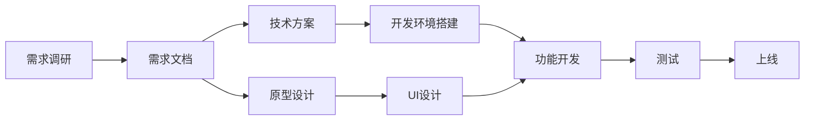
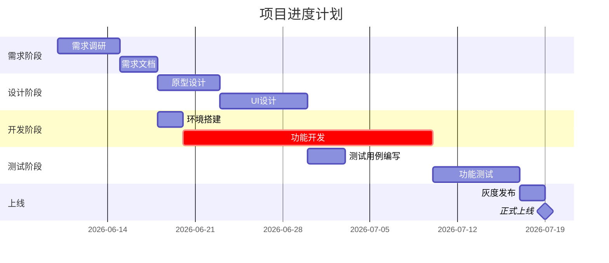

# 任务计划

这项技能指导你把复杂任务拆解为可执行的计划，让项目推进「有条理、可追踪、可预测」。核心不是「列清单」，而是「拆得清、排得对、看得见风险」。

## 何时使用

- 面对复杂项目不知从何入手
- 需要制定详细的项目计划
- 需要评估项目时间和资源需求
- 需要识别项目风险和依赖关系
- 需要向团队或领导展示项目规划

## 核心方法论

### 1. WBS 工作分解结构

**什么是 WBS：**
Work Breakdown Structure（工作分解结构）是将项目目标逐层分解为可执行任务的方法。

**分解原则：**
- **自上而下**：从项目目标开始，逐层细化
- **MECE 原则**：Mutually Exclusive, Collectively Exhaustive（相互独立、完全穷尽）
- **可管理粒度**：最底层任务应是 1-5 天可完成的工作单元
- **可交付导向**：每个任务都有明确的交付物

**分解层次：**
```
项目目标（Level 0）
├─ 阶段1（Level 1）
│  ├─ 子任务1.1（Level 2）
│  │  ├─ 工作包1.1.1（Level 3）
│  │  └─ 工作包1.1.2
│  └─ 子任务1.2
│     ├─ 工作包1.2.1
│     └─ 工作包1.2.2
└─ 阶段2
   ├─ 子任务2.1
   └─ 子任务2.2
```

**示例：筹备公司年会**
```
公司年会（目标）
├─ 场地准备
│  ├─ 场地选择（对比3个候选场地）
│  ├─ 场地预订（签订合同、支付定金）
│  └─ 场地布置（舞台、音响、灯光、座椅）
├─ 节目策划
│  ├─ 节目征集（发布通知、收集报名）
│  ├─ 节目筛选（初审、彩排、定稿）
│  └─ 节目串词（撰写串词、主持人排练）
├─ 物料采购
│  ├─ 礼品采购（确定预算、选品、下单）
│  ├─ 餐饮预订（确定菜单、人数、特殊需求）
│  └─ 宣传物料（海报、邀请函、签到墙）
└─ 人员协调
   ├─ 嘉宾邀请（名单确认、发送邀请、确认出席）
   ├─ 工作人员分工（签到、引导、摄影、后勤）
   └─ 应急预案（备用场地、医疗、安保）
```

### 2. SMART 目标原则

每个任务都应符合 SMART 标准：

- **Specific（具体）**：明确要做什么，不模糊
  - ❌ 「优化系统」
  - ✅ 「将首页加载时间从3秒降低到1.5秒」

- **Measurable（可衡量）**：有明确的完成标准
  - ❌ 「提升用户满意度」
  - ✅ 「用户满意度从3.5分提升到4.2分（5分制）」

- **Achievable（可实现）**：资源和能力可支撑
  - ❌ 「一周内完成全年的工作」
  - ✅ 「一周内完成第一阶段的原型设计」

- **Relevant（相关）**：与整体目标对齐
  - ❌ 「优化后台界面」（用户看不到的功能）
  - ✅ 「优化用户注册流程」（直接影响转化率）

- **Time-bound（有期限）**：明确截止时间
  - ❌ 「尽快完成」
  - ✅ 「6月15日前完成」

### 3. 关键路径法（CPM）

**什么是关键路径：**
项目中最长的依赖链，决定了项目的最短完成时间。关键路径上的任何延误都会导致整个项目延期。

**如何识别关键路径：**
1. 列出所有任务及其依赖关系
2. 估算每个任务的耗时
3. 画出网络图（节点 = 任务，箭头 = 依赖）
4. 计算每条路径的总时间
5. 最长的路径即为关键路径

**示例：**
```
任务A（3天）→ 任务C（5天）→ 任务E（2天）= 10天 ← 关键路径
任务B（4天）→ 任务D（3天）→ 任务E（2天）= 9天
```

**关键路径的意义：**
- 🎯 **重点关注**：关键路径上的任务优先级最高
- ⚠️ **风险识别**：这些任务延误会直接影响项目进度
- 📊 **资源调配**：优先分配资源给关键路径任务
- 🔄 **赶工策略**：需要赶工时，优先赶关键路径任务

### 4. 里程碑设置

**什么是里程碑：**
项目中的重要节点，标志着一个阶段的完成或重要交付物的产生。

**里程碑特征：**
- 零时长（不是任务，是检查点）
- 可验证（有明确的交付物或标准）
- 重要性（对项目有重要意义）

**里程碑示例：**
- ✅ 需求评审通过
- ✅ 原型设计完成
- ✅ 开发环境搭建完毕
- ✅ 第一版功能上线
- ✅ 用户验收测试通过
- ✅ 项目正式上线

**里程碑用途：**
- 阶段性检查（确认是否可以进入下一阶段）
- 向上汇报（给领导看项目进展的关键节点）
- 团队激励（完成里程碑可以庆祝）

## 实战步骤

### Step 1: 明确项目目标

**问自己5个问题：**
1. 这个项目要达成什么结果？（具体、可衡量）
2. 为谁做？（目标用户/受益者）
3. 为什么做？（业务价值/问题背景）
4. 什么时候要？（截止时间/期望上线日期）
5. 有什么约束？（预算/人力/技术限制）

### Step 2: WBS 任务拆解

**拆解模板：**
```markdown
# [项目名称] 任务拆解

## 项目目标
[一句话描述项目要达成的结果]

## 交付物清单
- 交付物1：[名称] - [质量标准]
- 交付物2：[名称] - [质量标准]

## 任务分解（WBS）

### 阶段1：[阶段名称] (预计XX天)
**阶段目标：** [这个阶段要达成什么]
**里程碑：** [阶段完成的标志]

#### 1.1 [子任务名称]
- 工作内容：[具体要做什么]
- 交付物：[产出什么]
- 负责人：[谁来做]
- 预计时间：[几天]
- 依赖：[需要什么前置条件]

#### 1.2 [子任务名称]
[同上]

### 阶段2：[阶段名称]
[同上]
```

### Step 3: 识别依赖关系

**依赖类型：**
- **前置依赖（FS）**：Finish-to-Start，A 完成后 B 才能开始
  - 例：需求文档完成 → 设计原型开始
- **同步依赖（SS）**：Start-to-Start，A 开始后 B 才能开始
  - 例：开发启动 → 测试环境准备启动
- **结束依赖（FF）**：Finish-to-Finish，A 完成时 B 也要完成
  - 例：开发完成 → 单元测试完成
- **开始结束（SF）**：Start-to-Finish，A 开始后 B 才能结束
  - 例：新系统上线 → 旧系统下线（较少见）

**依赖关系图（用 Mermaid）：**


### Step 4: 时间估算

**估算方法（三点估算）：**
```
最可能时间 = (乐观时间 + 4×最可能时间 + 悲观时间) / 6

例如：
- 乐观：2天（一切顺利）
- 最可能：3天（正常情况）
- 悲观：6天（遇到困难）
- 预估 = (2 + 4×3 + 6) / 6 = 3.3天 ≈ 4天
```

**缓冲时间：**
- 关键路径任务：留 20-30% 缓冲
- 非关键路径任务：留 10-20% 缓冲
- 整体项目：留 15-25% 缓冲

### Step 5: 资源分配

**资源评估表：**
```markdown
## 资源需求

### 人力资源
| 角色 | 人数 | 工作量（人天）| 时间段 | 备注 |
|-----|-----|-------------|--------|------|
| 产品经理 | 1 | 10 | Week1-2 | 需求阶段 |
| UI设计师 | 1 | 8 | Week2-3 | 设计阶段 |
| 前端开发 | 2 | 30 | Week3-6 | 开发阶段 |
| 后端开发 | 2 | 40 | Week3-7 | 开发阶段 |
| 测试工程师 | 1 | 15 | Week6-8 | 测试阶段 |

**总计：** 103 人天

### 其他资源
- 预算：XX 元
  - 服务器：XX 元/月
  - 第三方服务：XX 元
  - 其他：XX 元
- 设备：开发服务器、测试环境
- 外部依赖：第三方 API 接入
```

### Step 6: 风险识别与应对

**风险评估矩阵：**
```markdown
## 风险管理

| 风险 | 影响 | 概率 | 优先级 | 应对措施 |
|-----|-----|------|-------|---------|
| 需求频繁变更 | 高 | 高 | 🔴P1 | 1) 锁定核心需求<br>2) 敏捷迭代<br>3) 变更流程审批 |
| 关键人员离职 | 高 | 中 | 🟡P2 | 1) 知识文档化<br>2) 交叉培训<br>3) 备用人员 |
| 技术难点攻克不了 | 高 | 低 | 🟡P2 | 1) 提前技术预研<br>2) 备选方案<br>3) 外部专家支持 |
| 第三方服务故障 | 中 | 中 | 🟡P3 | 1) 服务降级方案<br>2) 多供应商备份 |

**影响：** 🔴高 / 🟡中 / 🟢低
**概率：** 高 / 中 / 低
**优先级：** P1（必须应对）/ P2（重点关注）/ P3（监控即可）
```

### Step 7: 生成甘特图

**使用 Mermaid 生成甘特图：**


## 输出模板

### 完整项目计划文档

```markdown
# [项目名称] 项目计划

## 一、项目概述

### 1.1 项目目标
[SMART 目标描述]

### 1.2 项目范围
**包含：**
- 功能1
- 功能2

**不包含：**
- XX功能（后期迭代）

### 1.3 项目约束
- 时间：必须在 [日期] 前上线
- 预算：不超过 [金额]
- 人力：最多 [人数] 人

## 二、任务分解（WBS）

[按阶段分解任务，参考 Step 2 模板]

## 三、进度安排

### 3.1 关键路径
[标注关键路径任务]

### 3.2 里程碑
| 序号 | 里程碑 | 日期 | 交付物 | 验收标准 |
|-----|-------|------|-------|---------|
| M1 | 需求评审通过 | MM-DD | 需求文档 | 评审无重大问题 |
| M2 | 设计稿定稿 | MM-DD | UI设计稿 | 产品确认 |
| M3 | 开发完成 | MM-DD | 可运行系统 | 功能完整 |
| M4 | 测试通过 | MM-DD | 测试报告 | 无P0/P1缺陷 |
| M5 | 正式上线 | MM-DD | 生产系统 | 稳定运行 |

### 3.3 甘特图
[插入 Mermaid 甘特图]

## 四、资源分配

[参考 Step 5 模板]

## 五、风险管理

[参考 Step 6 模板]

## 六、沟通计划

| 会议 | 频率 | 参与人员 | 目的 |
|-----|------|---------|------|
| 项目启动会 | 一次性 | 全体成员 | 明确目标和分工 |
| 每日站会 | 每天 | 开发团队 | 同步进度和问题 |
| 周会 | 每周 | 核心成员 | 回顾和规划 |
| 评审会 | 按阶段 | 相关方 | 阶段性验收 |

## 七、验收标准

### 7.1 功能验收
- [ ] 功能1：[具体标准]
- [ ] 功能2：[具体标准]

### 7.2 性能验收
- [ ] 响应时间 < XX秒
- [ ] 并发用户 > XX人

### 7.3 质量验收
- [ ] 无P0/P1缺陷
- [ ] 代码覆盖率 > XX%
```

## 输出要求

- 默认使用中文，结构清晰
- 计划文档使用 `write_file` 工具保存
- 任务清单使用 `update_todos` 工具追踪
- 甘特图使用 Mermaid 语法生成
- 时间格式统一为 YYYY-MM-DD
- 关键路径任务用醒目标记（🔴或 crit）

## 参考资料

- PMBOK（项目管理知识体系指南）
- WBS 工作分解结构实践
- 关键路径法（CPM）
- SMART 目标设定法
